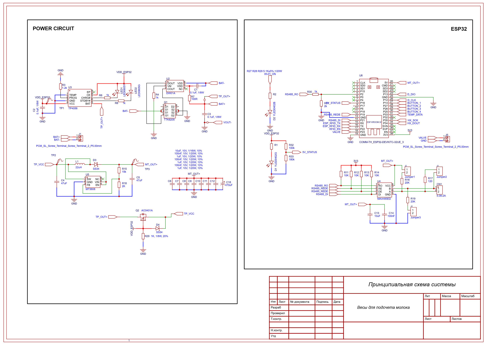
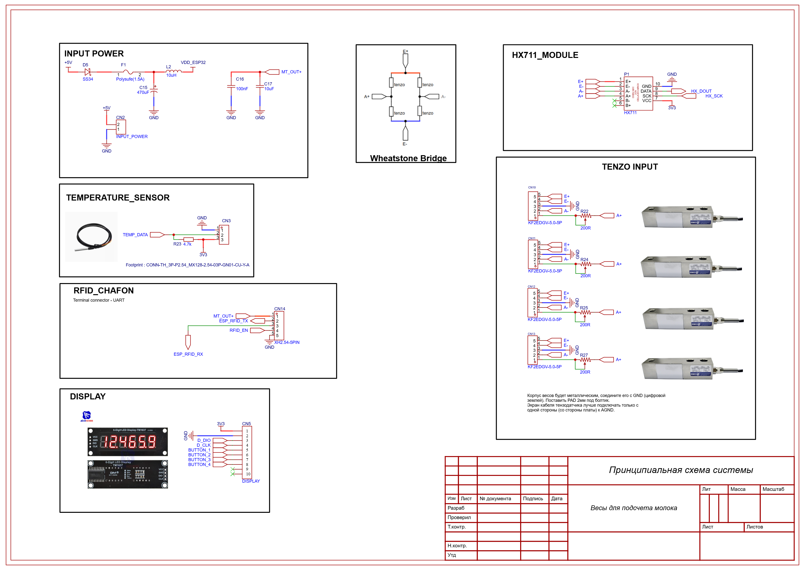
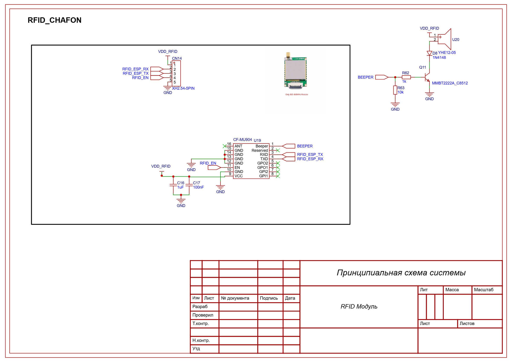

# Аппаратно-программная система идентификации и весового учёта молока: разработка и анализ качества данных опытной эксплуатации

> Статус документа: расширенный рабочий черновик статьи. Численные результаты,
> полученные из выгрузки, приведены по состоянию набора данных с SHA-256
> `dc51503d1ba754991596429ebcb1fb53a77f39b85500fd5033bc3cd1de2644ce`.
> Фрагменты с пометкой **[НУЖНО ДОБАВИТЬ]** нельзя считать завершёнными
> результатами исследования.

**Авторы:** [Ф. И. О. авторов]

**Организация:** [полное название организации]

**Автор для корреспонденции:** [Ф. И. О., e-mail]

## Аннотация

Автоматизированный учёт результатов доения требует совместной работы средств
идентификации животных, весоизмерительного тракта, локальной электроники и
серверной инфраструктуры. Нарушение любого из этих звеньев может приводить не
только к потере записей, но и к появлению формально корректных, однако неверно
интерпретируемых данных. В работе представлена аппаратно-программная система
Milkwarden, предназначенная для регистрации идентификатора животного, времени и
параметров весового измерения в процессе доения. Аппаратная часть построена на
микроконтроллере ESP32, АЦП HX711, тензометрических датчиках, RFID-считывателе и
узле резервного питания от Li-ion аккумулятора. Данные передаются в серверное
хранилище для последующего анализа.

Выполнен первичный аудит 6817 записей опытной эксплуатации за период с 10 мая
по 21 сентября 2026 года. Анализ проводился с сохранением исходных наблюдений:
пропущенные идентификаторы не восстанавливались, некорректные часы не заменялись
временем поступления записи на сервер, а интервалы без записей не объявлялись
отказами оборудования без независимого подтверждения. В 3658 записях (53,7 %)
отсутствовал RFID, 4114 записей (60,4 %) не содержали весового журнала, 912
записей (13,4 %) имели отрицательную, а 3576 (52,5 %) — нулевую разность
конечного и начального веса. Обнаружены три общесистемных интервала без записей,
включая период продолжительностью 17 дней. Доля записей без RFID существенно
различалась между устройствами — от 21,1 до 77,3 % для устройств с номерами
1–4.

Полученные результаты показывают, что пригодность данных для оценки надоев
определяется не только характеристиками весового тракта, но также полнотой RFID,
синхронизацией времени, логикой завершения сеанса и непрерывностью регистрации.
Предложен воспроизводимый подход к нормализации и маркировке качества записей.
Для метрологического подтверждения точности системы и установления причин
пропусков необходимы контрольные взвешивания, реестр животных, расписание доений
и журнал технического обслуживания.

**Ключевые слова:** точное животноводство; автоматизация доения; RFID;
тензометрическое измерение; ESP32; HX711; Интернет вещей; качество данных;
пропуски наблюдений; мониторинг молочного животноводства.

## 1. Введение

Цифровизация молочного животноводства предполагает переход от эпизодических
ручных наблюдений к непрерывной регистрации технологических операций и
показателей отдельных животных. Одной из базовых задач является связывание
результата доения с конкретным животным, временем операции и используемым
оборудованием. Такие данные потенциально могут применяться для контроля
продуктивности, выявления технологических нарушений и поддержки решений на
ферме [1–3].

Практическое внедрение подобных систем осложняется условиями эксплуатации:
перебоями электропитания и связи, загрязнением, механическими воздействиями,
изменением конфигурации оборудования и ошибками идентификации. Кроме того,
серверная запись сама по себе не гарантирует, что измерение является пригодным
для научного анализа. Отсутствующий RFID затрудняет построение индивидуальных
траекторий, некорректные часы нарушают временную последовательность, а
расхождение между итоговым значением веса и внутренним журналом может указывать
на особенности алгоритма либо на проблему измерительного тракта.

Существующие публикации рассматривают RFID-идентификацию, тензометрические
системы и IoT-мониторинг в сельском хозяйстве [4–7]. Вместе с тем для полевой
системы важно анализировать не только отдельный датчик, но всю цепочку
формирования данных: от физического воздействия на тензодатчики до появления
записи в базе. **[НУЖНО ДОБАВИТЬ: обзор 15–25 актуальных источников и чётко
сформулировать отличие Milkwarden от известных решений.]**

### 1.1. Цель и задачи исследования

Цель работы — разработать аппаратно-программную систему идентификации и
весового учёта молока и оценить качество данных, сформированных в ходе её
опытной эксплуатации.

Для достижения цели поставлены следующие задачи:

1. описать архитектуру устройства, измерительный тракт, RFID-подсистему,
   питание и передачу данных;
2. определить структуру серверной записи сеанса;
3. разработать воспроизводимую процедуру нормализации и контроля качества;
4. оценить полноту RFID-идентификации по системе и отдельным устройствам;
5. выявить проблемы времени, весовых значений и внутреннего весового журнала;
6. оценить непрерывность регистрации и интервалы отсутствия записей;
7. сформулировать ограничения набора данных и программу дальнейшей валидации.

### 1.2. Научная новизна и практическая значимость

Предлагаемый вклад работы состоит в совместном рассмотрении аппаратной
архитектуры и фактически формируемых ею полевых данных. Вместо автоматического
удаления или заполнения сомнительных значений каждой записи присваивается набор
независимых флагов качества с сохранением происхождения данных. Такой подход
позволяет повторно использовать исходную выгрузку при изменении критериев
анализа и не смешивать наблюдаемые и восстановленные значения.

Практическая значимость заключается в выявлении узлов, требующих доработки:
RFID-идентификации, регистрации весового журнала, контроля времени и
диагностики длительных перерывов. **[НУЖНО УТОЧНИТЬ: какие изменения уже внесены
в аппаратную часть или прошивку после аудита.]**

## 2. Материалы и методы

### 2.1. Общая архитектура системы

Система Milkwarden включает следующие функциональные уровни:

1. тензометрический узел, преобразующий механическую нагрузку в электрический
   сигнал;
2. АЦП HX711 для оцифровки сигнала тензометрического моста;
3. контроллер ESP32, выполняющий опрос модулей и формирование сеанса;
4. RFID-считыватель CF-MU904 для получения идентификатора бирки;
5. пользовательский интерфейс с цифровым дисплеем и кнопками;
6. интерфейс RS-485 и/или сетевой канал для обмена данными;
7. основной и резервный контуры питания;
8. серверное хранилище записей.

**[НУЖНО ДОБАВИТЬ: структурную схему прохождения данных от коровы и ёмкости с
молоком до серверной базы; протокол сетевой передачи; название серверной
платформы и модель развёртывания.]**

### 2.2. Основная электронная плата

Основная плата объединяет ESP32, узел питания, интерфейс RS-485 и подключения
периферии. На схеме предусмотрены сигналы HX711 (`HX_SCK`, `HX_DOUT`), RFID,
дисплея, кнопок и управления исполнительным выходом. Использование ESP32
обеспечивает обработку измерений и возможность сетевого обмена. Конкретная
модель отладочного модуля на схеме обозначена как ESP32-DEVKITC-32UE.

**Рисунок 1 — Принципиальная схема узлов питания, ESP32 и интерфейса RS-485.**

**[НУЖНО ДОБАВИТЬ: размеры платы, материал, число слоёв, фотографии TopLayer,
BottomLayer, собранной платы и установки в корпус; условия защиты от влаги и
загрязнения.]**

### 2.3. Весоизмерительный тракт

Весоизмерительный тракт включает тензометрические датчики, объединённые в
мостовую схему, и модуль HX711. На электрической схеме предусмотрены четыре
разъёма подключения тензодатчиков. Сигналы моста `E+`, `E−`, `A+` и `A−`
поступают на HX711, а цифровые линии `HX_DOUT` и `HX_SCK` соединяют преобразователь
с ESP32.

**Рисунок 2 — Подключение тензодатчиков, HX711, температурного датчика, дисплея и RFID.**

В серверной записи сохраняются начальный и конечный вес, а при наличии —
последовательности времени и показаний внутреннего весового журнала. В текущей
версии прошивки перед передачей итоговые значения делятся на 1000; поэтому при
аудите рабочей гипотезой является выражение итогового веса в килограммах, а
журнала — в граммах. Версия прошивки для каждой исторической записи в выгрузке
отсутствует, поэтому эта гипотеза не использовалась для безусловного
пересчёта аномальных значений.

**[НУЖНО ДОБАВИТЬ: модель и номинальную нагрузку тензодатчиков, класс точности,
частоту опроса HX711, цифровую фильтрацию, процедуру тарирования, калибровочный
коэффициент, рабочий диапазон и результаты испытаний эталонными грузами.]**

### 2.4. RFID-подсистема

Идентификация реализована на базе RFID-модуля CF-MU904, соединённого с ESP32 по
UART. Отдельная плата содержит цепи питания, разрешения модуля и управления
звуковым индикатором.

**Рисунок 3 — Принципиальная схема платы RFID-считывателя.**

RFID сохраняется как строковый идентификатор сеанса. При нормализации пустые
значения не заменялись предполагаемым идентификатором по соседним сеансам.

**[НУЖНО ДОБАВИТЬ: тип и стандарт бирок, рабочую частоту, мощность, конструкцию
и положение антенны, экспериментальную дальность считывания, число повторных
попыток и тайм-аут алгоритма.]**

### 2.5. Подсистема питания

В состав устройства входят контроллер заряда Li-ion аккумулятора TP4056,
защитный узел DW01A с ключами и повышающий преобразователь MT3608 с выходным
напряжением 5 В. По замыслу системы при пропадании внешнего питания устройство
должно автоматически продолжать работу от аккумулятора.

**[НУЖНО ДОБАВИТЬ: тип и ёмкость аккумулятора, потребляемый ток в различных
режимах, измеренное время автономной работы, время заряда, проверку корректности
переключения и поведение при критическом разряде.]**

### 2.6. Формирование сеанса и структура данных

Исходная серверная выгрузка содержит поля:

- `id` — идентификатор записи;
- `esp_id` — идентификатор устройства;
- `rfid` — считанный идентификатор бирки;
- `weight_initial`, `weight_final` — начальное и конечное значения веса;
- `start_time`, `end_time` — часы начала и завершения сеанса;
- `end_reason` — код причины завершения;
- `created_at` — время появления записи на сервере;
- `distance_initial_mm`, `distance_final_mm` — значения канала расстояния;
- `weight_log_t`, `weight_log_g` — временная шкала и значения весового журнала.

По текущему исходному коду прошивки `end_reason=0` трактуется как завершение при
уходе коровы, а `end_reason=1` — как смена бидона. При этом в одном из серверных
интерфейсов те же коды ранее отображались как «успешно» и «ошибка». В настоящей
работе используется трактовка прошивки, но расхождение интерфейсов считается
ограничением и требует сверки с версиями программного обеспечения.

### 2.7. Исходный набор данных

Материалом исследования служила выгрузка `sessions_rows.csv` из серверной базы.
Она включает 6817 строк. Диапазон корректно распознанных дат начала сеанса — с
10 мая по 21 сентября 2026 года. Контрольная сумма SHA-256 исходного файла:
`dc51503d1ba754991596429ebcb1fb53a77f39b85500fd5033bc3cd1de2644ce`.

Для построения календаря применена временная зона UTC+05:00. Это явное
допущение анализа, которое должно быть подтверждено местоположением объекта и
настройками устройств. Крайние дни диапазона могли быть неполными.

**[НУЖНО ДОБАВИТЬ: описание объекта эксплуатации, поголовье, количество
доильных мест, расписание доений, даты монтажа устройств, режим опытной
эксплуатации и этические/организационные разрешения при необходимости.]**

### 2.8. Нормализация данных

Обработка выполнялась скриптом `normalize_sessions.py` на Python 3 без сторонних
библиотек. Алгоритм:

1. читает исходный CSV без изменения исходного файла;
2. нормализует представление RFID;
3. преобразует часы сеанса в UTC и UTC+05:00 при допустимом диапазоне;
4. рассчитывает длительность сеанса;
5. расшифровывает причину завершения;
6. рассчитывает точную разность исходных значений веса;
7. при допустимом масштабе формирует значение разности в предполагаемых
   килограммах;
8. подсчитывает точки весового журнала;
9. формирует независимые флаги качества;
10. строит календарь покрытия и список интервалов без записей;
11. сохраняет параметры, счётчики и контрольную сумму в `audit.json`.

Все строки имеют `provenance=observed` и `is_imputed=false`. Ни одного
наблюдения или значения при нормализации добавлено не было.

### 2.9. Правила контроля качества

Использованы следующие основные признаки:

- отсутствие RFID;
- некорректное время начала или окончания;
- нулевая или отрицательная разность веса;
- подозрительный масштаб веса при абсолютной разности более 100 условных единиц;
- отсутствие весового журнала или наличие единственной точки;
- расхождение края весового журнала и итогового значения более 0,15 кг;
- длительность более 7200 с;
- нулевая длительность;
- отсутствие или нулевое значение канала расстояния;
- тестовая запись;
- смена бидона.

Флаги не означают автоматического исключения строки. Одна запись может иметь
несколько признаков одновременно, поэтому суммы категорий не обязаны равняться
общему числу строк.

### 2.10. Анализ временного покрытия

Для каждого календарного дня рассчитывались число сеансов, число записей по
времени поступления, количество пропущенных RFID, распределение знака разности
веса, наличие весового журнала и список активных устройств. День без записей
помечался как отсутствие регистрации, но не как подтверждённый отказ.

Интервалы определялись отдельно для всей системы и для каждого устройства. Дни
до первого и после последнего появления конкретного устройства не включались в
его внутренние интервалы отсутствия.

### 2.11. Статистическая обработка

В текущем черновике применена описательная статистика: абсолютные и относительные
частоты, медиана, 90-й процентиль, минимум и максимум. Доли отсутствующего RFID
рассчитаны по каждому `esp_id`.

**[НУЖНО ДОБАВИТЬ ПЕРЕД ПОДАЧЕЙ: доверительные интервалы для долей; формальный
тест различий между устройствами или модель вероятности успешного RFID с учётом
даты и устройства; анализ чувствительности к критериям качества. При большом
числе повторных записей нельзя трактовать строки как независимые наблюдения без
учёта кластеризации.]**

## 3. Результаты

### 3.1. Общая характеристика выгрузки

В анализ включены все 6817 исходных записей. Из них 6651 запись (97,6 %)
соответствовала коду завершения `cow_left`, а 166 (2,4 %) — коду
`bucket_change`. Для 6805 записей удалось рассчитать неотрицательную числовую
длительность. Медиана длительности составила 488 с, 90-й процентиль — 1095 с.
Максимальное значение 119796 с указывает на аномальную запись либо длительное
незавершённое состояние и не должно интерпретироваться как обычное доение.

**Таблица 1 — Основные признаки качества данных**

| Признак | Число записей | Доля от 6817, % |
|---|---:|---:|
| Отсутствует RFID | 3658 | 53,7 |
| Отсутствует весовой журнал | 4114 | 60,4 |
| Нулевая разность веса | 3576 | 52,5 |
| Отрицательная разность веса | 912 | 13,4 |
| Одна точка весового журнала | 766 | 11,2 |
| Расхождение начальной точки журнала | 511 | 7,5 |
| Расхождение конечной точки журнала | 744 | 10,9 |
| Длительность более 2 ч | 139 | 2,0 |
| Нулевая длительность | 21 | 0,3 |
| Некорректное время начала | 12 | 0,2 |
| Некорректное время окончания | 5 | 0,1 |
| Подозрительный масштаб/выброс веса | 13 | 0,2 |
| Смена бидона | 166 | 2,4 |
| Тестовая запись | 2 | <0,1 |

### 3.2. Полнота RFID-идентификации

RFID отсутствовал более чем в половине всех записей. При этом результат заметно
различался между устройствами (таблица 2). Пять строк с `esp_id=0` также не
содержали RFID; из-за малого количества и неясного статуса они выделены отдельно.

**Таблица 2 — Полнота RFID по устройствам**

| `esp_id` | Число записей | Без RFID | Доля без RFID, % |
|---:|---:|---:|---:|
| 0 | 5 | 5 | 100,0 |
| 1 | 2293 | 1773 | 77,3 |
| 2 | 2329 | 1012 | 43,5 |
| 3 | 774 | 163 | 21,1 |
| 4 | 1416 | 705 | 49,8 |
| **Всего** | **6817** | **3658** | **53,7** |

Различия могут быть связаны с положением антенны, конфигурацией устройства,
версией прошивки, поведением оператора или составом обслуживаемых животных.
Имеющиеся данные не позволяют выбрать одну из этих причин. Для причинного
анализа необходимы контролируемые испытания и журнал конфигураций.

**[МЕСТО ДЛЯ РИСУНКА 4: доля успешной RFID-идентификации по устройствам с
доверительными интервалами.]**

### 3.3. Качество весовых данных

В 3576 строках разность `weight_final - weight_initial` равнялась нулю, а в 912
была отрицательной. Следовательно, прямое отождествление этой разности с массой
полученного молока без учёта алгоритма, тарирования и смены ёмкости некорректно.
Тринадцать строк превысили эвристический порог абсолютной разности 100 и были
помечены для проверки масштаба либо выброса.

Весовой журнал отсутствовал в 4114 записях, а 766 журналов содержали только одну
точку. Расхождение начального края журнала с итоговым начальным весом более
0,15 кг обнаружено в 511 строках, конечного края — в 744. Такое расхождение само
по себе не доказывает ошибку: последняя точка журнала могла быть записана раньше
формального окончания сеанса.

**[МЕСТО ДЛЯ РИСУНКА 5: распределение разности веса после подтверждения единиц
измерения и исключения тестовых/масштабных аномалий.]**

**[МЕСТО ДЛЯ РИСУНКА 6: примеры временных весовых журналов — нормальный,
нулевой, отрицательный и со сменой бидона.]**

### 3.4. Временная корректность и длительность

Некорректное время начала выявлено в 12 строках, время окончания — в пяти.
Такие записи сохранены в нормализованной таблице, но не использованы как
достоверные события соответствующей календарной даты. Время `created_at`
показывает поступление на сервер и анализируется отдельно; оно не подменяет
время физического измерения.

Для 139 строк длительность превысила два часа, а для 21 была нулевой. Эти случаи
требуют сопоставления с логикой автомата состояний прошивки и журналами
перезапусков.

### 3.5. Непрерывность регистрации

Для всей системы обнаружены три интервала без записей с корректным временем
начала:

- 11–14 мая 2026 года — 4 дня;
- 16 мая 2026 года — 1 день;
- 24 июня–10 июля 2026 года — 17 дней.

Устройство 3 дополнительно не имело записей с 4 по 19 июня включительно. Также
зафиксированы короткие интервалы отсутствия для отдельных устройств. Эти
интервалы описывают только содержимое выгрузки. Возможными объяснениями являются
простой, отсутствие доений, отключение оборудования, потеря связи, изменение
состава выгрузки или техническое обслуживание, однако ни одна причина не
подтверждена имеющимися файлами.

**[МЕСТО ДЛЯ РИСУНКА 7: календарная тепловая карта числа сеансов по устройствам.]**

**[МЕСТО ДЛЯ РИСУНКА 8: временная шкала общесистемных и индивидуальных
интервалов отсутствия записей.]**

### 3.6. Канал измерения расстояния

В 3659 строках значения расстояния отсутствовали, а во всех 3158 строках с
непустыми значениями они были равны нулю. Поэтому по текущей выгрузке нельзя
обосновать использование этого канала для оценки уровня молока. Необходима
проверка подключения, прошивки и физического датчика.

## 4. Обсуждение

### 4.1. Связь аппаратной архитектуры и качества данных

Результаты показывают необходимость анализировать систему как единую цепочку.
RFID-плата и алгоритм опроса определяют возможность связать сеанс с животным;
тензодатчики и HX711 — форму весового сигнала; ESP32 и прошивка — границы и
причину завершения сеанса; часы устройства — временную привязку; питание и связь
— вероятность доставки записи на сервер.

Высокая доля отсутствующего RFID не означает автоматически неисправность
считывателя. Запись могла быть создана без бирки в зоне действия антенны,
считывание могло завершиться по тайм-ауту, бирка могла отсутствовать в реестре
или идентификатор мог потеряться на последующем этапе. Однако различия между
устройствами дают основание запланировать сравнительные испытания антенн,
положения монтажа и версий прошивки.

Нулевая и отрицательная разность веса также допускает несколько объяснений:
неверное тарирование, колебания платформы, изменение ёмкости, обратный порядок
фиксации значений, незавершённый сеанс или несогласованность единиц. До
метрологической проверки такие значения следует считать флагами качества, а не
готовыми оценками надоя.

### 4.2. Интерпретация пропусков

Интервалы без записей принципиально отличаются от нулевого надоя. Отсутствие
строки означает, что в рассматриваемой выгрузке нет зарегистрированного события,
но не сообщает, происходило ли доение фактически. Поэтому заполнение длительного
17-дневного интервала средними или интерполированными значениями создало бы
ложные наблюдения.

Восстановление отдельных коротких пропусков допустимо исследовать только при
наличии реестра животных и расписания доений. Метод следует проверять путём
искусственного сокрытия известных реальных наблюдений, а оценки хранить отдельно
с `is_imputed=true`, названием метода и показателем неопределённости.

### 4.3. Воспроизводимость

Исходная выгрузка идентифицирована контрольной суммой. Скрипт нормализации
использует только стандартную библиотеку Python и создаёт нормализованный набор,
календарь покрытия, перечень интервалов и машинно-читаемый аудит. Это позволяет
повторить вычисления и проверить, какие правила были применены.

В репозитории присутствует также отдельный синтетический набор для 16 условных
коров. Он может применяться для демонстрации алгоритмов и тестирования графиков,
но не использовался как доказательство реальной продуктивности, точности системы
или причин наблюдаемых пропусков.

### 4.4. Сопоставление с известными решениями

**[НУЖНО НАПИСАТЬ ПОСЛЕ ОБЗОРА ЛИТЕРАТУРЫ: сравнить Milkwarden по стоимости,
измерительному принципу, способу идентификации, автономности, открытости
архитектуры и полноте полевых данных как минимум с 5–10 решениями. Не заявлять
превосходство без сопоставимых экспериментов.]**

### 4.5. Ограничения исследования

1. Отсутствуют эталонные контрольные взвешивания, поэтому метрологическая
   точность системы не установлена.
2. Не подтверждены исторические единицы измерения и версии прошивки для каждой
   записи.
3. Нет реестра животных и полного расписания доений.
4. Нет подтверждённого журнала отключений, ремонтов и выездов инженеров.
5. Причины интервалов без записей неизвестны.
6. Отсутствующие RFID нельзя надёжно восстановить из самой выгрузки.
7. Значения канала расстояния непригодны для содержательного анализа.
8. Крайние дни диапазона могут быть неполными.
9. Сеанс со сменой бидона может быть частью одного доения; строки не обязательно
   соответствуют независимым доениям.
10. Отсутствуют сведения о погоде, рационе, стадии лактации и состоянии
    животных; причинные выводы о продуктивности невозможны.

## 5. Программа дополнительных экспериментов

### 5.1. Метрологическое испытание весового тракта

Предлагается использовать набор поверенных грузов в рабочем диапазоне. Для
каждой точки следует выполнить не менее **[указать число]** повторений при
нагружении и разгружении. Рассчитать абсолютную и относительную ошибку,
повторяемость, нелинейность, гистерезис и дрейф нуля. Испытание повторить при
нескольких температурах и после длительной непрерывной работы.

**Таблица 3 — Шаблон результатов калибровки**

| Эталонная масса, кг | Среднее показание, кг | SD, кг | Ошибка, кг | Ошибка, % |
|---:|---:|---:|---:|---:|
| [ ] | [ ] | [ ] | [ ] | [ ] |

### 5.2. Испытание RFID

Для каждого устройства следует измерить вероятность успешного считывания при
различных расстояниях, ориентациях и скоростях перемещения бирки. Необходимо
фиксировать тип бирки, мощность, положение антенны, число попыток и время до
успешного чтения.

### 5.3. Испытание автономного питания

Следует зарегистрировать время работы от аккумулятора, длительность переключения
при исчезновении внешних 5 В, наличие перезапуска ESP32 и судьбу незавершённого
сеанса. Испытания провести при полностью заряженном и частично разряженном
аккумуляторе.

### 5.4. Проверка доставки данных

Необходимо сопоставить число локально сформированных сеансов с числом записей на
сервере при нормальной связи, кратковременном отключении и длительном отсутствии
сети. Полезно добавить уникальный идентификатор сеанса, номер версии прошивки,
счётчик перезапусков и диагностические причины неполной записи.

## 6. Рекомендации по доработке системы

На основании аудита целесообразно рассмотреть:

1. обязательное сохранение версии прошивки и конфигурации в каждой записи;
2. явный статус RFID: успешно, тайм-аут, ошибка интерфейса, отсутствует бирка;
3. контроль синхронизации часов и отдельный признак достоверности времени;
4. локальную очередь неподтверждённых сервером записей;
5. уникальный UUID сеанса для защиты от повторной отправки;
6. сохранение причины перезапуска и показателей питания;
7. единый справочник кодов завершения на устройстве и сервере;
8. диагностический статус HX711 и число принятых отсчётов;
9. хранение калибровочного коэффициента и даты последней калибровки;
10. автоматический мониторинг пропусков по устройствам;
11. раздельное хранение наблюдаемых и восстановленных значений;
12. журнал технического обслуживания с привязкой ко времени и устройству.

## 7. Заключение

Разработана аппаратно-программная система Milkwarden, объединяющая
тензометрический весовой тракт на базе HX711, микроконтроллер ESP32,
RFID-идентификацию, пользовательский интерфейс, серверную регистрацию и
резервное питание. Архитектура позволяет формировать записи, содержащие
идентификатор устройства и животного, границы сеанса, итоговые значения веса и,
в части случаев, внутренний весовой журнал.

Аудит 6817 записей показал, что основными ограничениями текущего набора являются
неполная RFID-идентификация, отсутствие весового журнала, высокая доля нулевых и
отрицательных разностей веса, а также интервалы отсутствия регистрации. Доля
пропущенных RFID существенно различалась между устройствами. Это указывает на
необходимость совместной проверки аппаратной установки, прошивки и регламента
эксплуатации.

Предложенная процедура нормализации сохраняет исходные наблюдения и маркирует
сомнительные случаи без автоматического исправления. Такой подход создаёт основу
для воспроизводимого анализа, но не заменяет метрологическую и эксплуатационную
валидацию. Следующий этап должен включать контрольные взвешивания, испытания
RFID, проверку резервного питания и сопоставление серверных данных с журналом
фактических доений и технического обслуживания.

## Благодарности

**[НУЖНО ДОБАВИТЬ: участники разработки, хозяйство, инженеры, консультанты.]**

## Финансирование

**[НУЖНО ДОБАВИТЬ: источник финансирования и номер проекта либо указать, что
внешнее финансирование отсутствовало.]**

## Вклад авторов

**[НУЖНО ДОБАВИТЬ по схеме CRediT: концепция, аппаратная разработка, прошивка,
сервер, сбор данных, анализ, визуализация, написание, руководство.]**

## Конфликт интересов

Авторы заявляют **[об отсутствии конфликта интересов / описать конфликт]**.

## Доступность данных и кода

Скрипт нормализации и производные материалы подготовлены в репозитории проекта.
**[НУЖНО РЕШИТЬ: можно ли публиковать исходную выгрузку; удалить или
псевдонимизировать чувствительные идентификаторы; указать постоянную ссылку и
лицензию после публикации репозитория.]**

## Этические аспекты

Исследование использует данные технологической системы. **[НУЖНО УТОЧНИТЬ:
требуется ли разрешение комиссии по биоэтике, владельца хозяйства или оператора
данных; описать отсутствие вмешательства либо протокол эксперимента.]**

## Список литературы

> Ниже оставлен каркас. Перед подачей все позиции необходимо заменить реальными
> источниками и оформить по требованиям журнала.

1. [Обзор цифровых технологий в молочном животноводстве.]
2. [Обзор precision livestock farming.]
3. [Система автоматизированного контроля молочной продуктивности.]
4. [RFID-идентификация крупного рогатого скота.]
5. [Надёжность RFID в условиях животноводческого объекта.]
6. [Тензометрические системы и HX711/аналоги.]
7. [IoT-архитектуры для сельского хозяйства.]
8. [Контроль качества потоковых данных датчиков.]
9. [Методы анализа пропусков во временных рядах.]
10. [Метрологическая оценка весоизмерительных систем.]

## Приложение А. Связь утверждений с данными

| Утверждение | Источник | Статус |
|---|---|---|
| 6817 исходных записей | `processed/audit.json` | подтверждено выгрузкой |
| Период 10.05–21.09.2026 | `processed/audit.json` | подтверждено для корректных часов |
| 3658 записей без RFID | `processed/audit.json` | подтверждено выгрузкой |
| 17-дневный интервал без записей | `processed/gaps.csv` | отсутствие строк подтверждено; причина неизвестна |
| Единицы итогового веса — кг | текущая прошивка | рабочая гипотеза для исторических данных |
| Перерыв связан с ремонтом | журнал отсутствует | не подтверждено |
| Система точно измеряет надой | контрольных взвешиваний нет | не подтверждено |
| Резервное питание повышает доступность | схема и проектное описание | требует экспериментальной проверки |

## Приложение Б. Минимальный комплект иллюстраций

1. Структурная схема всей системы.
2. Принципиальная схема основной платы.
3. Схема тензодатчиков и HX711.
4. Схема RFID-платы.
5. Верхний и нижний слои печатной платы.
6. Фотография собранной платы в корпусе.
7. Фотография установленного устройства.
8. Диаграмма полноты RFID по устройствам.
9. Тепловая карта активности устройств по дням.
10. Примеры весовых журналов.
11. Результаты калибровки эталонными грузами.

## Приложение В. Контрольный список перед подачей

- [ ] Выбран журнал и учтены его требования к объёму и структуре.
- [ ] Заполнены авторы, организация и контакты.
- [ ] Выполнен обзор литературы.
- [ ] Подтверждены временная зона и единицы измерения.
- [ ] Получен реестр устройств, версий прошивки и дат установки.
- [ ] Получены расписание доений и журнал обслуживания.
- [ ] Проведена калибровка эталонными грузами.
- [ ] Проведено контролируемое испытание RFID.
- [ ] Проверено резервное питание.
- [ ] Построены графики по реальным данным.
- [ ] Удалены либо защищены чувствительные идентификаторы.
- [ ] Согласованы формулировки о причинах пропусков.
- [ ] Оформлены ссылки и список литературы.
- [ ] Указаны финансирование, вклад авторов и конфликт интересов.
- [ ] Зафиксированы версия кода и контрольная сумма анализируемых данных.
